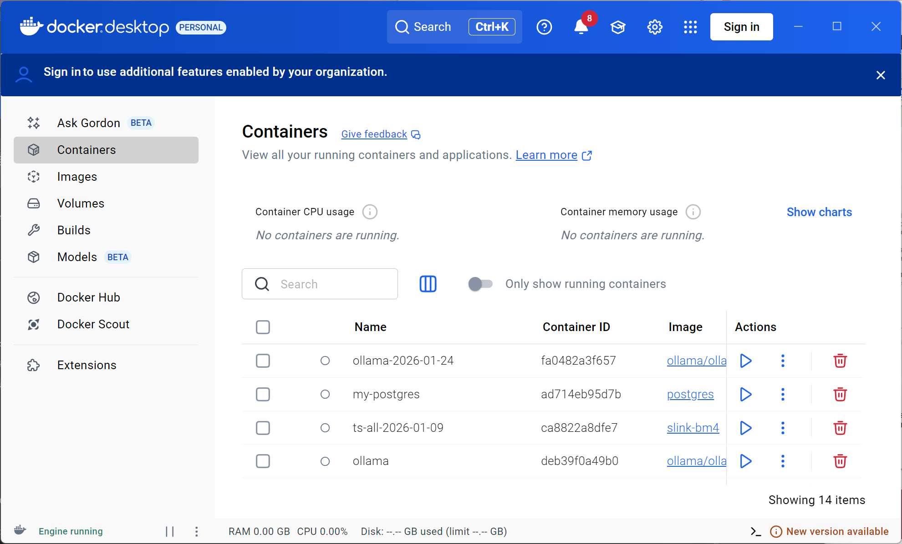

# k3d-demo.adligo.org

A demo of K3D running Apache Hadoop HDFS, Apache Kafka, Prometheus, Grafana, and an Istio/Envoy ingress gateway (and eventually Apache Flink / Beam) on an Ubuntu VM.


# Warning

This code was mostly created by Claude, and although I have tested to see it work, I haven't done a through analysis of everything contained here.  I will be cleaning up Claudes work in the future :)  

### VERIFY / USE AT YOUR OWN RISK!  

# Prerequisites / Setup Notes

- [Ubuntu on VirtualBox Setup Notes](docs/UBUNTU_VBOX_SETUP_NOTES.md)
- [Windows Setup Notes](docs/WINDOWS_SETUP_NOTES.md)

## Step 1: Install Docker Desktop

K3D runs K3s inside Docker containers, so Docker must be installed first.  Note the majority of Docker users prefer Docker Desktop so we will use it!

 - [official instructions](https://docs.docker.com/desktop/)

Note:  Docker Desktop does NOT work well when installed on Virtual Box in many cases.  Virtual Box users will likely want to use Docker Station instead, refer to the following README;

- [Ubuntu on VirtualBox Setup Notes](docs/UBUNTU_VBOX_SETUP_NOTES.md)

After you complete the installation you should see a GUI window like this;




### 1d: Verify Docker is working

```bash
docker run --rm hello-world
```

## Step 2: Install kubectl

kubectl is the Kubernetes command-line tool, follow the official instructions.

 - [Install kubectl](https://kubernetes.io/docs/tasks/tools/)

Verify:

```bash
kubectl version --client
```

## Step 3: Install K3D

K3D is a lightweight wrapper that runs K3s (a minimal Kubernetes distribution) inside Docker.

- [Official K3D installation instructions](https://k3d.io/stable/#releases)


Verify:

```bash
k3d version
```

## Step 4: Install Helm

Helm is the Kubernetes package manager used to deploy HDFS and Kafka.

- [Official Helm Installation Instructions](https://helm.sh/docs/intro/install/)

Verify:

```bash
helm version
```

## Step 5: Create the K3D Cluster

If you have any existing k3d clusters or orphaned containers, tear them down first:

- [TEARDOWN_NOTES.md](docs/TEARDOWN_NOTES.md)

Create a single-server K3D cluster named `demo`:

```bash
k3d cluster create demo \
  --servers 1 --agents 4 \
  --k3s-arg "--disable=traefik@server:0" \
  -p "8081:80@loadbalancer" \
  -p "9094:9092@loadbalancer"
```

This creates:
- 1 server node (runs the Kubernetes control plane)
- 4 agent nodes (worker nodes where HDFS and Kafka pods will run)
- `--disable=traefik` — K3s ships with a Traefik ingress that grabs
  port 80; we disable it so the Istio gateway (Step 12) can use that
  port instead.
- `-p "8081:80@loadbalancer"` — maps **host port 8081** → gateway HTTP
  port 80.  This is how you'll reach Grafana, Prometheus, Kiali, and
  the HDFS UI from your browser in Step 14.  (8081 rather than 8080
  because 8080 is a very popular default — local dev proxies, Jenkins,
  Tomcat, etc. all fight over it.)
- `-p "9094:9092@loadbalancer"` — maps **host port 9094** → gateway TCP
  port 9092 for Kafka bootstrap.

> **Already created a cluster without these flags?**  Delete it with
> `k3d cluster delete demo` and re-run the command above — K3D port
> mappings cannot be added to an existing cluster.

Verify the cluster is running:

```bash
kubectl cluster-info
kubectl get nodes
```

You should see 5 nodes (1 server + 4 agents) all in `Ready` status.

## Step 6: Deploy HDFS with Helm

Add the Hadoop Helm chart repository and install HDFS using the provided
lightweight values file:

```bash
# Install HDFS using the demo values file (from the root of this repo)
helm install hadoop ./helm-charts/hadoop -f hdfs-values.yaml
```

Note these helm-charts were created using commands in [HELM_README.md](helm-charts/HELM_README.md)

Wait for all pods to become ready (this may take a few minutes as images are pulled):

```bash
# This command updates after every 5-7m 
kubectl get pods -w
```

You should eventually see pods like:
- `hadoop-hadoop-hdfs-nn-0` (NameNode) — Running
- `hadoop-hadoop-hdfs-dn-0` (DataNode) — Running
- `hadoop-hadoop-hdfs-dn-1` (DataNode) — Running
- `hadoop-hadoop-yarn-rm-0` (YARN ResourceManager) — Running
- `hadoop-hadoop-yarn-nm-0` (YARN NodeManager) — Running

Press `Ctrl+C` to stop watching once all pods show `Running`.

## Step 7: Verify HDFS is Working

Open a shell inside the NameNode pod and run HDFS commands:

```bash
# Get a shell on the NameNode
kubectl exec -it hadoop-hadoop-hdfs-nn-0 -- /bin/bash

# Inside the pod, run these HDFS commands:
hdfs dfs -ls /
hdfs dfs -mkdir /test
hdfs dfs -ls /
echo "Hello HDFS on K3D!" > /tmp/hello.txt
hdfs dfs -put /tmp/hello.txt /test/
hdfs dfs -cat /test/hello.txt

# Exit the pod
exit
```

## Step 8: Enable the HDFS Web Interface (optional)

> **This step is now optional.**  The upload script in Step 15 reaches
> HDFS through the Istio gateway (Step 14), so it no longer needs these
> port-forwards.  Run this step only if you want to poke at the HDFS UI
> *before* you've installed Istio.

The NameNode exposes both a management Web UI and the **WebHDFS REST API** on
port 9870.

Port-forward the NameNode **and** one DataNode to your local machine.  Run each
command in its own terminal, or background them with `&`:

```bash
# NameNode — Web UI + WebHDFS REST API (port 9870)
kubectl port-forward hadoop-hadoop-hdfs-nn-0 9870:9870 &

# DataNode — WebHDFS file-write endpoint (port 51000)
# The NameNode redirects file writes to a DataNode; this port-forward
# lets you reach it from localhost.
# NOTE: The Helm chart configures DataNode HTTP on port 51000, not the
# Hadoop default of 9864.
kubectl port-forward hadoop-hadoop-hdfs-dn-0 51000:51000 &
# The Ampersands at the end of these lines & enable the
# port forwarding to continue even after the shell is closed!
```

Verify the port-forwards are working:

```bash
# Should print JSON (not "Connection refused")
curl -s "http://localhost:9870/webhdfs/v1/?user.name=root&op=LISTSTATUS"
```

> **Note:** WebHDFS requests must include `user.name=root` because the HDFS
> NameNode runs as `root` inside the container.  Without this parameter,
> WebHDFS defaults to the unprivileged `dr.who` user and returns
> **403 Forbidden** on any write operation.  The upload script handles this
> automatically.

You can now browse the HDFS management UI at http://localhost:9870

## Step 9: Deploy Kafka with Helm

Add the Bitnami Helm chart repository and install Kafka using the provided
values file:

```bash
# Install Kafka using the demo values file (from the root of this repo)
helm install kafka ./helm-charts/kafka -f kafka-values.yaml
```

Note these helm-charts were created using commands in [HELM_README.md](helm-charts/HELM_README.md)

Wait for all pods to become ready (this may take a few minutes as images are pulled):

```bash
kubectl get pods -w
```

You should eventually see pods like:
- `kafka-controller-0` — Running
- `kafka-controller-1` — Running
- `kafka-controller-2` — Running

Press `Ctrl+C` to stop watching once all three controller pods show `Running`.

### Create the demo topics

Once all controller pods are running, create the three topics manually:

```bash
kubectl exec -it kafka-controller-0 -- kafka-topics.sh \
  --bootstrap-server kafka:9092 --create --topic ocrImages \
  --partitions 3 --replication-factor 3 \
  --config retention.ms=604800000

kubectl exec -it kafka-controller-0 -- kafka-topics.sh \
  --bootstrap-server kafka:9092 --create --topic batchSignals \
  --partitions 3 --replication-factor 3 \
  --config retention.ms=604800000

kubectl exec -it kafka-controller-0 -- kafka-topics.sh \
  --bootstrap-server kafka:9092 --create --topic generalEvents \
  --partitions 3 --replication-factor 3 \
  --config retention.ms=604800000
```

### Verify topics

```bash
kubectl exec -it kafka-controller-0 -- kafka-topics.sh \
  --bootstrap-server kafka:9092 --list
```

You should see `ocrImages`, `batchSignals`, and `generalEvents`.

To inspect a specific topic:

```bash
kubectl exec -it kafka-controller-0 -- kafka-topics.sh \
  --bootstrap-server kafka:9092 --describe --topic ocrImages
```

### Optional: produce and consume a test message

```bash
# In one terminal — start a consumer
kubectl exec -it kafka-controller-0 -- kafka-console-consumer.sh \
  --bootstrap-server kafka:9092 --topic generalEvents --from-beginning

# In another terminal — send a message
kubectl exec -it kafka-controller-0 -- bash -c \
  'echo "hello kafka" | kafka-console-producer.sh --bootstrap-server kafka:9092 --topic generalEvents'
```

## Step 10: Deploy Prometheus with Helm

Prometheus scrapes and stores time-series metrics from the K3D cluster
(node CPU/memory, pod restart counts, Kubernetes object state, etc.).
Grafana (Step 11) and Kiali (Step 13) both read from it.

```bash
# Install Prometheus using the demo values file (from the root of this repo)
helm install prometheus ./helm-charts/prometheus -f prometheus-values.yaml
```

Note these helm-charts were created using commands in [HELM_README.md](helm-charts/HELM_README.md)

Wait for all pods to become ready:

```bash
kubectl get pods -w
```

You should eventually see pods like:
- `prometheus-server-xxxxxxxxxx-xxxxx` (Prometheus Server) — Running
- `prometheus-kube-state-metrics-xxxxxxxxxx-xxxxx` (K8s object metrics) — Running
- `prometheus-prometheus-node-exporter-xxxxx` (one per node, host metrics) — Running

Press `Ctrl+C` to stop watching once all pods show `Running`.

**→ [How to use Prometheus — queries, targets, docs](docs/PROMETHEUS_USAGE.md)**

## Step 11: Deploy Grafana with Helm

Grafana turns the raw Prometheus metrics from Step 10 into dashboards and
graphs.  `grafana-values.yaml` pre-wires Prometheus as the default
datasource, so it's useful the moment it starts.

```bash
# Install Grafana using the demo values file (from the root of this repo)
helm install grafana ./helm-charts/grafana -f grafana-values.yaml
```

Note these helm-charts were created using commands in [HELM_README.md](helm-charts/HELM_README.md)

Wait for the pod to become ready:

```bash
kubectl get pods -w
```

You should eventually see:
- `grafana-xxxxxxxxxx-xxxxx` — Running

Press `Ctrl+C` to stop watching once the pod shows `Running`.

**→ [How to use Grafana — login, dashboards, query editing, docs](docs/GRAFANA_USAGE.md)**

## Step 12: Deploy Istio with Helm

Istio is a service mesh.  Its **control plane** (`istiod`) programs
**Envoy** proxies — both the ingress gateway and optional per-pod
sidecars — with routing rules, mTLS certs, and telemetry config.
For this demo we use the gateway as the single front door for
everything you want to reach from outside the cluster.

Istio is split across three charts that must be installed **in order**,
all into a dedicated `istio-system` namespace:

```bash
# 1. CRDs and cluster-wide RBAC
helm install istio-base ./helm-charts/istio-base \
  -n istio-system --create-namespace

# 2. Control plane (istiod / Pilot) — wait for it before continuing
helm install istiod ./helm-charts/istio-istiod \
  -n istio-system -f istiod-values.yaml --wait

# 3. Ingress gateway — the Envoy pod that actually receives traffic
helm install istio-gateway ./helm-charts/istio-gateway \
  -n istio-system -f istio-gateway-values.yaml
```

Note these helm-charts were created using commands in [HELM_README.md](helm-charts/HELM_README.md)

Wait for both pods to become ready:

```bash
kubectl get pods -n istio-system -w
```

You should eventually see:
- `istiod-xxxxxxxxxx-xxxxx` (Control Plane) — Running
- `istio-gateway-xxxxxxxxxx-xxxxx` (Envoy Ingress Gateway) — Running

Press `Ctrl+C` to stop watching once both pods show `Running`.

## Step 13: Deploy Kiali with Helm

Kiali is the Istio dashboard.  It reads traffic metrics from Prometheus
and mesh config from istiod to draw a live graph of which services are
talking to each other.

```bash
# Install Kiali using the demo values file
helm install kiali ./helm-charts/kiali-server \
  -n istio-system -f kiali-values.yaml
```

Note these helm-charts were created using commands in [HELM_README.md](helm-charts/HELM_README.md)

Wait for the pod to become ready:

```bash
kubectl get pods -n istio-system -w
```

You should eventually see:
- `kiali-xxxxxxxxxx-xxxxx` — Running

Press `Ctrl+C` to stop watching once the pod shows `Running`.

**→ [How to use Istio, Envoy and Kiali — traffic graph, config validation, sidecar injection, docs](docs/ISTIO_USAGE.md)**

## Step 14: Expose Services through the Istio Gateway

Up to now every UI has required its own `kubectl port-forward`.  This
step wires one Envoy gateway in front of everything.

We expose these services because we want to **store data** (HDFS),
**send data into streams** (Kafka), and **remotely monitor the cluster
and its traffic** (Prometheus, Grafana, Kiali).

Apply the Gateway and VirtualService definitions:

```bash
kubectl apply -f istio-routes.yaml
```

This creates one `Gateway` (ports + hostnames Envoy listens on), six
`VirtualService` objects (where to forward each hostname/port inside the
cluster), and one small `Service` wrapper that exposes the DataNode
WebHDFS port so the gateway can reach it.

### Access everything from your browser

No more port-forwards — just open these URLs directly.  The `8081` comes
from the `-p "8081:80@loadbalancer"` flag you passed to `k3d cluster
create` in Step 5.

| Service    | URL                                | Purpose                        |
|------------|------------------------------------|--------------------------------|
| Grafana    | http://grafana.localhost:8081      | Dashboards & visualisation     |
| Prometheus | http://prometheus.localhost:8081   | Raw metrics & PromQL           |
| Kiali      | http://kiali.localhost:8081        | Service-mesh traffic graph     |
| HDFS UI    | http://hdfs.localhost:8081         | NameNode browser + WebHDFS API |
| HDFS DN    | http://hdfs-dn.localhost:8081      | DataNode write endpoint¹       |
| Kafka      | `localhost:9094` (TCP)             | Bootstrap server²              |

> **¹ HDFS DN** is not a browsable UI — it's the endpoint the upload
> script hits after the NameNode tells it which DataNode should receive
> a file block.  You won't open this in a browser yourself.
>
> **² Kafka external clients** will connect to the bootstrap address,
> receive internal broker hostnames in the metadata response, and then
> fail.  Fixing this requires reconfiguring Kafka's `advertised.listeners`
> (out of scope for this demo).  The upload script in Step 15 sidesteps
> this by running the producer *inside* the cluster via `kubectl exec`.

> **`*.localhost` not resolving?**  Most modern OSes resolve any
> `*.localhost` name to `127.0.0.1` automatically.  If yours doesn't,
> add this line to `/etc/hosts`:
> ```
> 127.0.0.1 grafana.localhost prometheus.localhost kiali.localhost hdfs.localhost hdfs-dn.localhost
> ```

### Verify the gateway is routing correctly

```bash
# Each of these should return HTTP/1.1 200
curl -sI http://grafana.localhost:8081    | head -1
curl -sI http://prometheus.localhost:8081 | head -1
curl -sI http://kiali.localhost:8081      | head -1
curl -sI http://hdfs.localhost:8081       | head -1
```

## Step 15: Run the Batch Upload Script

This Python script uploads the `math-images/` directory to HDFS and sends
start/complete signals to the `batchSignals` Kafka topic.  All HDFS
traffic (NameNode **and** DataNode) goes through the Istio/Envoy gateway
— no port-forwards needed.  The two Kafka messages still use
`kubectl exec` (see the source-code comment above `send_kafka_message`
for why external Kafka clients can't simply go through the gateway).
No pip dependencies — only the Python standard library.

### Prerequisites

The Istio gateway routes from **Step 14** must be applied:

```bash
# Quick check — should print HTTP/1.1 200 OK
curl -sI http://hdfs.localhost:8081 | head -1
```

If not, re-run `kubectl apply -f istio-routes.yaml` from Step 14.

### Watch Kafka messages (optional — run in a separate terminal)

```bash
kubectl exec -it kafka-controller-0 -- kafka-console-consumer.sh \
  --bootstrap-server kafka:9092 --topic batchSignals --from-beginning
```

### Run the upload

```bash
cd src
python3 upload_math_images.py
```

The script will:
1. Send a `BATCH_UPLOAD_STARTING` JSON message to the `batchSignals` topic
2. Upload each `.png` from `math-images/` into HDFS at `/math-images/` via
   the WebHDFS REST API, routed through the Envoy gateway
   (4 concurrent workers)
3. Send a `BATCH_UPLOAD_COMPLETE` JSON message to the `batchSignals` topic

> **Bonus:** open http://kiali.localhost:8081 → **Traffic Graph** while
> the upload runs and watch the `hdfs` / `hdfs-dn` edges light up live.

### Verify files in HDFS

```bash
kubectl exec -it hadoop-hadoop-hdfs-nn-0 -- hdfs dfs -ls /math-images
# optionally delete the folder with this command and iterate on the
# upload_math_images.py Python program
kubectl exec -it hadoop-hadoop-hdfs-nn-0 -- hdfs dfs -rm -r /math-images

```

## Cleanup

- [TEARDOWN_NOTES.md](docs/TEARDOWN_NOTES.md)

## Configuration

- [CONFIG_DETAILS.md](docs/CONFIG_DETAILS.md)

## Troubleshooting

- [TROUBLESHOOTING.md](docs/TROUBLESHOOTING.md)
