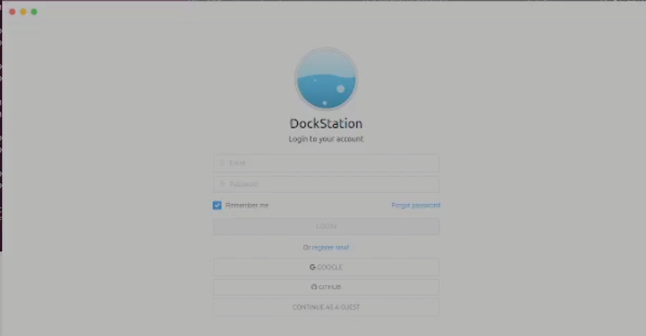
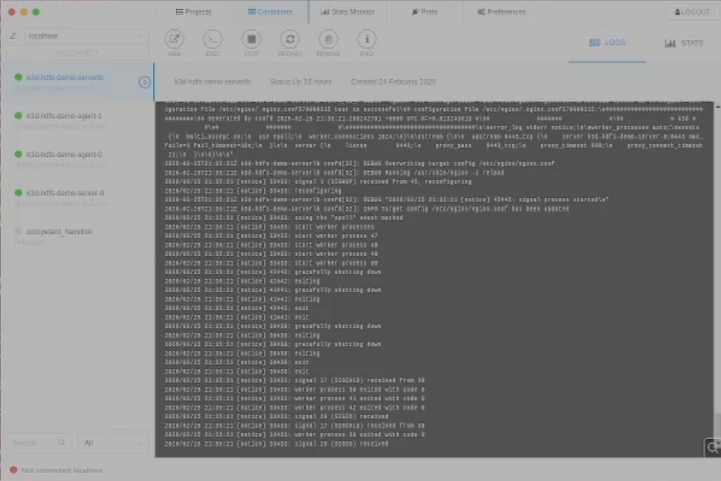
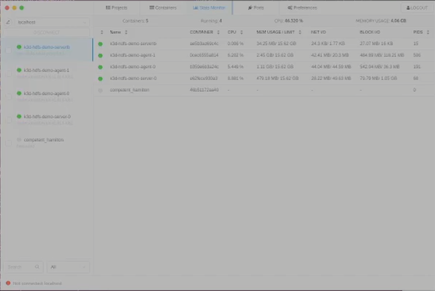
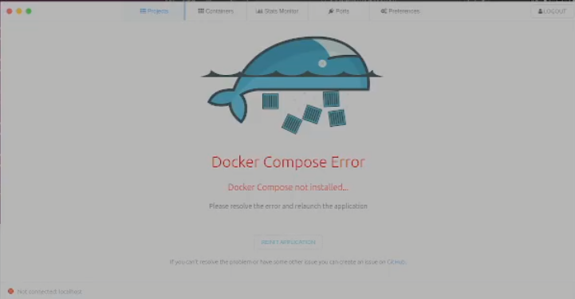

# Ubuntu on Virtual Box Setup Notes


# Add Docker's official GPG key:
sudo apt-get update
sudo apt-get install ca-certificates cursor curl
sudo install -m 0755 -d /etc/apt/keyrings
sudo curl -fsSL https://download.docker.com/linux/ubuntu/gpg -o /etc/apt/keyrings/docker.asc
sudo chmod a+r /etc/apt/keyrings/docker.asc

# Add the repository to Apt sources:
echo \
  "deb [arch=$(dpkg --print-architecture) signed-by=/etc/apt/keyrings/docker.asc] https://download.docker.com/linux/ubuntu \
  $(. /etc/os-release && echo "$VERSION_CODENAME") stable" | \
  sudo tee /etc/apt/sources.list.d/docker.list > /dev/null
sudo apt-get update

# Install the engine
sudo apt-get install docker-ce docker-ce-cli containerd.io docker-buildx-plugin docker-compose-plugin

# Install DockerStation as a surrogate for Docker Desktop

https://github.com/DockStation/dockstation/releases

```
./dockstation-1.5.1-x86_64.AppImage --appimage-extract
./squashfs-root/dockstation
or if you put this in a apps folder under the root directory;
/apps/squashfs-root/dockstation
```

At this point you should see the Docker Station GUI illustrated below;



You can login as Guest.  You may see a [Docker Compose Error](#docker-compose-not-installed-error) which I'm diagnosing below.

## Containers View



## Stats Monitor



## Docker Compose Not Installed Error

If you haven't already installed Docker Compose you will see an error like this.




## Install Docker Compose  

Follow the instructions at the official Docker Compose page;

- [https://docs.docker.com/compose/install/linux/](https://docs.docker.com/compose/install/linux/)

Note, I haven't actually fixed this yet :)

